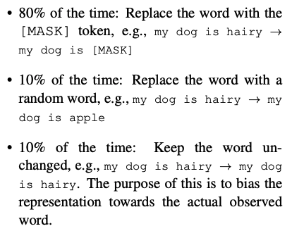
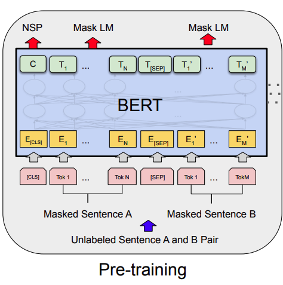
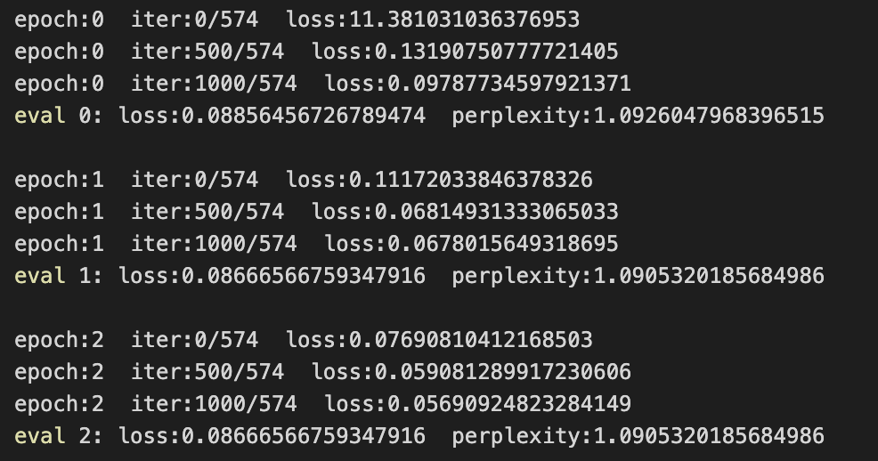

# Pretrain_Bert_with_MaskLM

## Info
使用Mask LM预训练任务来预训练Bert模型。

基于pytorch框架，训练关于垂直领域语料的预训练语言模型，目的是提升下游任务的表现。


## Pretraining Task
Mask Language Model，简称Mask LM，即基于Mask机制的预训练语言模型。
同时支持 原生的`MaskLM`任务和`Whole Words Masking`任务。默认使用`Whole Words Masking`。

### MaskLM
使用来自于Bert的mask机制，即对于每一个句子中的词（token）：
* 85%的概率，保留原词不变
* 15%的概率，使用以下方式替换
    * 80%的概率，使用字符`[MASK]`，替换当前token。
    * 10%的概率，使用词表随机抽取的token，替换当前token。
    * 10%的概率，保留原词不变。
    <!-- *  -->
    * 
### Whole Words Masking
与MaskLM类似，但是在mask的步骤有些少不同。
在Bert类模型中，考虑到如果单独使用整个词作为词表的话，那词表就太大了。不利于模型对同类词的不同变种的特征学习，故采用了WordPiece的方式进行分词。
`Whole Words Masking`的方法在于，在进行mask操作时，对象变为分词前的整个词，而非子词。


## Model
使用原生的Bert模型作为基准模型。
* 


## Datasets
项目里的数据集来自`wikitext`，分成两个文件训练集（train.txt）和测试集（test.txt）。

数据以行为单位存储。

若想要替换成自己的数据集，可以使用自己的数据集进行替换。（注意：如果是预训练中文模型，需要修改配置文件`Config.py`中的`self.initial_pretrain_model`和`self.initial_pretrain_tokenizer`，将值修改成 `bert-base-chinese`）

自己的数据集不需要做mask机制处理，代码会处理。


## Training Target
本项目目的在于基于现有的预训练模型参数，如google开源的`bert-base-uncased`、`bert-base-chinese`等，在垂直领域的数据语料上，再次进行预训练任务，由此提升bert的模型表征能力，换句话说，也就是提升下游任务的表现。


## Environment

项目主要使用了Huggingface的`datasets`、`transformers`模块，支持CPU、单卡单机、单机多卡三种模式。


可通过以下命令安装依赖包
```
    pip install -r requirement.txt
```
主要包含的模块如下：
```
    python3.6
    torch==1.3.0
    tqdm==4.61.2
    transformers==4.6.1
    datasets==1.10.2
    numpy==1.19.5
    pandas==1.1.3
```


## Get Start

### 单卡模式
直接运行以下命令
```
    python train.py
```
或修改Config.py文件中的变量`self.cuda_visible_devices`为单卡后，运行
```
    chmod 755 run.sh
    ./run.sh
```

### 多卡模式
如果你足够幸运，拥有了多张GPU卡，那么恭喜你，你可以进入起飞模式。🚀🚀

（1）使用torch的`nn.parallel.DistributedDataParallel`模块进行多卡训练。其中`config.py`文件中参数如下，默认可以不用修改。

* <font color=#009393>`self.cuda_visible_devices`表示程序可见的GPU卡号，示例：`1,2`→可在GPU卡号为1和2上跑，亦可以改多张，如`0,1,2,3`。</font>
* <font color=#009393>`self.device`在单卡模式，表示程序运行的卡号；在多卡模式下，表示master的主卡，默认会变成你指定卡号的第一张卡。若只有cpu，那么可修改为`cpu`。</font>
* <font color=#009393>`self.port`表示多卡模式下，进程通信占用的端口号。（无需修改）</font>
* <font color=#009393>`self.init_method`表示多卡模式下进程的通讯地址。（无需修改）</font>
* <font color=#009393>`self.world_size`表示启动的进程数量（无需修改）。在torch==1.3.0版本下，只需指定一个进程。在1.9.0以上，需要与GPU数量相同。</font>


（2）运行程序启动命令
```
    chmod 755 run.sh
    ./run.sh
```

# Experiment
使用交叉熵（cross-entropy）作为损失函数，困惑度（perplexity）和Loss作为评价指标来进行训练，训练过程如下：
<!--  -->


# Reference

【Bert】[https://arxiv.org/pdf/1810.04805.pdf](https://arxiv.org/pdf/1810.04805.pdf)

【transformers】[https://github.com/huggingface/transformers](https://github.com/huggingface/transformers)

【datasets】[https://huggingface.co/docs/datasets/quicktour.html](https://huggingface.co/docs/datasets/quicktour.html)


